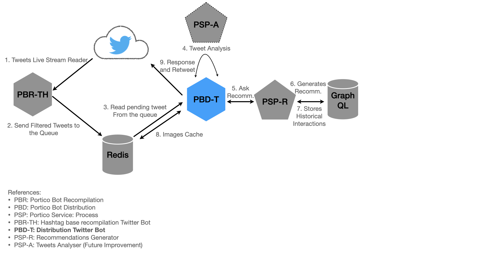

# Twitter Distribution Bot (PBD-T)

Distribution Bot: Twitter

This is a bot ment to send tweets (and retweets) using the Twitter API and a given set of account credentials.

## What's the use case?

It reads a queue of tweets from a Redis DB, and uses other internal services to prepares an answer, and then sends the new tweet and retweet the original one.

## Architecture



## Development

Since the Twitter credentias are sensitve data, they are not pushed in plain text but encrypted using [git-secrets](https://github.com/awslabs/git-secrets#description).

To run the service from local, follow these steps:

1. Decrypt the `.env.secret` file

2. Get the containers running:

   ```bash
   docker-compose up -d
   ```

3. Access the golang container to build and/or run the app.

   ```bash
   docker run exec -it pbd-t-local sh
   ```

4. Run your local code:

   ```bash
   go run ./cmd/app/...
   ```

### Building the Image

Use `docker build` command:

```bash
docker build --build-arg SHA1VER=`git rev-parse HEAD` -t porticolabs/pbd-t .
```

## Running the bot

Use the image locally built (or pull it from the [public repo](https://hub.docker.com/r/porticolabs/pbd-t)) to get the pod running.

To do it on your local machine you can use the following command:

```bash
docker run --rm --name pbd-t \
-e CONSUMER_KEY=XXA \
-e CONSUMER_SECRET=XXB \
-e ACCESS_TOKEN=XXC \
-e ACCESS_TOKEN_SECRET=XXD \
porticolabs/pbd-t
```

## Developing on local

If you're working on some changes to the app, you can run the code on your local with this docker command: 

```bash
docker run --rm --name pbd-t -it \
-v `pwd`:/go/src \
--workdir /go/src \
-e CONSUMER_KEY=XXA \
-e CONSUMER_SECRET=XXB \
-e ACCESS_TOKEN=XXC \
-e ACCESS_TOKEN_SECRET=XXD \
golang:1.15-alpine sh
```

Then, in the container use `go run` to test your code:

```bash
go run ./cmd/app/...
```

## How is this repository organized

It follows an standar GoLang project layout as described [here](https://github.com/golang-standards/project-layout).